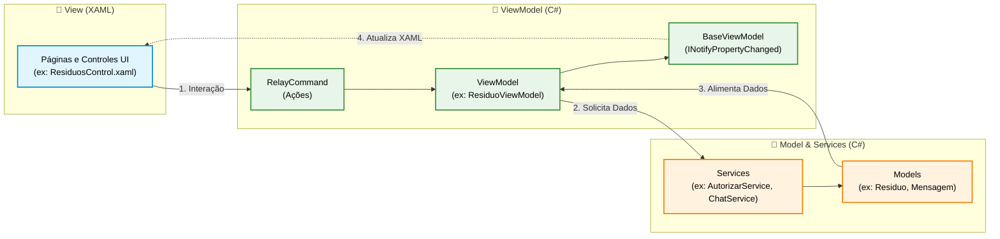

# ReGraphik — Gestão de Estoque Reverso
 
> Sistema de gestão e automação focado em sustentabilidade e eficiência operacional para o setor gráfico.
 


---

## Sumário
 
- [Sobre o Projeto](#sobre-o-projeto)
- [O Desafio](#o-desafio)
- [Nossa Solução](#nossa-solução)
- [Arquitetura](#arquitetura)
- [Tecnologias](#tecnologias)
- [Estrutura do Repositório](#estrutura-do-repositório)
- [API REST — Endpoints](#api-rest--endpoints)
- [ApiConfig — Autenticação e Cadastro](#apiconfig--autenticação-e-cadastro)
- [Modelos de Dados](#modelos-de-dados)
- [Frontend Desktop (WPF)](#frontend-desktop-wpf)
- [Integrações Externas](#integrações-externas)
- [Como Executar](#como-executar)
- [Documentação](#documentação)
- [Integrantes](#integrantes)

---

## Sobre o Projeto
 
O **ReGraphik** é um software desenvolvido para resolver um problema real do setor gráfico: o descarte inadequado de resíduos como papel, cartão e vinil. O sistema transforma esses materiais descartados em valor através de um ciclo completo de gestão — do cadastro do resíduo à localização de pontos de coleta e sugestão de reaproveitamento.
 
O projeto é composto por uma **API REST** em ASP.NET Core integrada ao **Firebase Realtime Database**, um **serviço de autenticação** (`ApiConfig`) e um **cliente desktop** desenvolvido em WPF seguindo o padrão MVVM.
 
---

## O Desafio
 
Empresas do setor gráfico geram diariamente resíduos como papel A4, cartões, vinil e outros materiais que são descartados sem critério, gerando:
 
- Custos desnecessários de descarte
- Alto impacto ambiental
- Perda de matéria-prima que poderia ser reaproveitada

---

## Nossa Solução
 
O ReGraphik atua em três pilares:
 
**1. Gestão de Estoque Reverso**
Organização inteligente dos resíduos gerados dentro das próprias gráficas, com controle de tipo, quantidade, condição, dimensões e status de cada material.
 
**2. Economia Circular**
Transformação de resíduos em matéria-prima para personalização de novos produtos como camisetas, canecas e brindes, integrando sustentabilidade ao processo produtivo.
 
**3. Sugestões de Reaproveitamento**
Algoritmos de sugestão que relacionam cada tipo de resíduo cadastrado à melhor forma de reaproveitamento, reduzindo desperdício de forma inteligente.
 
---

## Arquitetura
 
O projeto segue rigorosamente o padrão **MVVM (Model-View-ViewModel)** na camada de apresentação e uma arquitetura de **serviços desacoplados** na API REST.
 
```
ReGraphikApp/
├── ApiRestReGraphik/          # Backend principal — ASP.NET Core REST API
│   ├── Controllers/           # Endpoints HTTP (CRUD completo)
│   ├── Data/                  # Configuração do Firebase Client
│   ├── Models/                # Entidades do domínio
│   ├── Services/              # Regras de negócio e acesso ao Firebase
│   └── Program.cs             # Configuração da aplicação, DI, Swagger, CORS
│
├── ApiConfig/                 # Serviço auxiliar — Autenticação e Cadastro
│   ├── Controllers/           # Validação de token e cadastro de usuário
│   ├── Models/                # Modelos de acesso e usuário
│   ├── Services/              # TokenService (geração de código numérico)
│   └── Program.cs
│
├── ReGraphik/                 # Frontend — WPF Desktop (MVVM)
│   ├── Commands/              # RelayCommand (padrão Command do MVVM)
│   ├── Converters/            # IValueConverter para binding de UI
│   ├── Imgs/                  # Recursos de imagem
│   ├── Models/                # Espelho das entidades do domínio
│   ├── Services/              # Serviços de negócio e integrações
│   │   └── Interface/         # Interfaces dos serviços (IAutorizarService, etc.)
│   ├── Styles/                # Estilos XAML globais
│   ├── ViewModels/            # Lógica de apresentação (14 ViewModels)
│   └── Views/                 # Janelas e controles XAML
│       └── Controls/          # Dashboard, Resíduos, Mapa, Chat, ESG, Relatórios...
│
├── Modelagem/                 # Documentação técnica (PDFs)
├── Banco de Dados/            # Scripts e documentação do banco
└── ReGraphik_MVVM_APIRest.pptx  # Apresentação técnica da arquitetura
```

**Fluxo da aplicação:**
 
```
Cliente WPF  →  API REST (ASP.NET Core)  →  Firebase Realtime Database
                        ↓
               Google Maps Places API  (busca de pontos de coleta)
```

---

## Como o Mapa funciona — do clique ao pin

### 1. Usuário clica em "Buscar" (View — XAML)
 
```xml
<Button Content="Buscar"
        Command="{Binding BuscarCommand}"/>
 
<TextBox x:Name="TxtCidade"
         Text="São Paulo"/>
```
 
### 2. WPF manda pedido pra API (MapaPage.xaml.cs)
 
```csharp
private async void BtnBuscar_Click(object sender, RoutedEventArgs e)
{
    var cidade = TxtCidade.Text.Trim();
 
    var urlApi = $"https://webregraphik.runasp.net/api/PontosColeta/google" +
                 $"?cidade={Uri.EscapeDataString(cidade)}";
 
    var resposta = await _http.GetAsync(urlApi);
}
```
 
### 3. API pergunta pro Google Maps (PontosColetaController.cs)
 
```csharp
var query = $"ponto de coleta reciclagem {cidade}";
var url   = $"https://maps.googleapis.com/maps/api/place/textsearch/json" +
            $"?query={Uri.EscapeDataString(query)}&key={apiKey}";
 
var json = await _httpClient.GetStringAsync(url);
```
 
### 4. Google Maps responde — API salva no Firebase (PontosColetaService.cs)
 
```csharp
var resultado = await _firebaseClient
    .Child("pontos_coleta")
    .PostAsync(novoPonto);
 
novoPonto.Id = resultado.Key; // ID gerado pelo Firebase
```
 
### 5. API devolve a lista pro WPF (PontosColetaController.cs)
 
```csharp
return Ok(listaGoogle); // JSON com lat/lng de cada ponto
```
 
### 6. Usuário vê os pontos no mapa (MapaPage.xaml.cs)
 
```csharp
private void CarregarMapa(List<PontosColeta> pontos)
{
    var html    = GerarHtml(pontos);     // monta HTML com Leaflet.js
    var tmpFile = Path.Combine(Path.GetTempPath(), "regraphik_mapa.html");
 
    File.WriteAllText(tmpFile, html, Encoding.UTF8);
    MapaBrowser.Navigate(new Uri(tmpFile)); // abre no WebBrowser do WPF
}
```

---
 
## Tecnologias
 
| Camada | Tecnologia |
|---|---|
| Linguagem | C# (.NET 8) |
| Frontend | WPF — Windows Presentation Foundation |
| Padrão de Projeto | MVVM |
| Backend | ASP.NET Core Web API |
| Banco de Dados | Firebase Realtime Database |
| Autenticação Firebase | Google Credential (Service Account JSON) |
| Mapa | Google Maps Places API + Leaflet.js (WebBrowser/WebView2) |
| Chat | Firebase Realtime Database (direto do cliente WPF) |
| Validação de Cadastro | Token numérico de 6 dígitos gerado pelo ApiConfig |
| Documentação API | Swagger / OpenAPI |
| CORS | Aberto para qualquer origem (configurável para produção) |
 
---

## Estrutura do Repositório
 
```
ReGraphikApp/
├── ApiRestReGraphik/
│   ├── Controllers/
│   │   ├── UsuarioController.cs
│   │   ├── ResiduoController.cs
│   │   ├── PontosColetaController.cs
│   │   ├── SugestaoController.cs
│   │   └── SugestaoResiduosController.cs
│   ├── Services/
│   │   ├── UsuarioService.cs
│   │   ├── ResiduoService.cs
│   │   ├── PontosColetaService.cs
│   │   ├── SugestaoService.cs
│   │   └── SugestaoResiduosService.cs
│   ├── Models/
│   │   ├── Usuario.cs
│   │   ├── Residuo.cs
│   │   ├── PontosColeta.cs
│   │   ├── Sugestao.cs
│   │   ├── SugestaoResiduo.cs
│   │   ├── LoginRequest.cs
│   │   └── RequisicaoToken.cs
│   ├── Models/DTOs/
│   │   ├── UsuarioDto.cs
│   │   ├── ResiduoDto.cs
│   │   ├── PontosColetaDto.cs
│   │   ├── SugestaoDto.cs
│   │   ├── SugestaoResiduoDto.cs
│   │   └── SolicitarAcessoDto.cs
│   ├── Data/
│   │   └── DbReGraphik.cs
│   ├── Program.cs
│   └── appsettings.json
│
├── ApiConfig/
│   ├── Controllers/
│   │   ├── AcessoCadastroController.cs
│   │   └── UsuarioCadastroController.cs
│   ├── Models/
│   │   ├── AcessoCadastro.cs
│   │   └── UsuarioCadastro.cs
│   ├── Services/
│   │   └── TokenService.cs
│   └── Program.cs
│
├── ReGraphik/
│   ├── Views/
│   │   ├── MainWindow.xaml
│   │   ├── LoginWindow.xaml
│   │   ├── RecuperarSenhaWindow.xaml
│   │   ├── ChatPainelWindow.xaml
│   │   ├── MensagemWindow.xaml
│   │   └── SugestaoResiduoWindow.xaml
│   ├── Views/Controls/
│   │   ├── DashboardControl.xaml
│   │   ├── ResiduosControl.xaml
│   │   ├── EstoqueReversoControl.xaml
│   │   ├── MapaControl.xaml
│   │   ├── SugestaoResiduoControl.xaml
│   │   ├── RelatoriosControl.xaml
│   │   ├── ContaControl.xaml
│   │   └── EsgControl.xaml
│   ├── ViewModels/
│   │   ├── BaseViewModel.cs
│   │   ├── MainViewModel.cs
│   │   ├── LoginViewModel.cs
│   │   ├── CadastroViewModel.cs
│   │   ├── DashboardViewModel.cs
│   │   ├── ResiduoViewModel.cs
│   │   ├── EstoqueReversoViewModel.cs
│   │   ├── MapaViewModel.cs
│   │   ├── SugestaoResiduoViewModel.cs
│   │   ├── ChatViewModel.cs
│   │   ├── RelatorioViewModel.cs
│   │   ├── ContaViewModel.cs
│   │   ├── EsgViewModel.cs
│   │   └── UsuarioViewModel.cs
│   ├── Models/
│   │   ├── Usuario.cs
│   │   ├── Residuo.cs
│   │   ├── PontosColeta.cs
│   │   ├── Sugestao.cs
│   │   ├── SugestaoResiduo.cs
│   │   ├── Mensagem.cs
│   │   ├── Conversa.cs
│   │   └── RespostaToken.cs
│   ├── Services/
│   │   ├── Interface/
│   │   │   ├── IAutorizarService.cs
│   │   │   ├── IChatService.cs
│   │   │   └── IResiduoService.cs
│   │   ├── AutorizarService.cs
│   │   ├── ChatService.cs
│   │   ├── FirebaseConfig.cs
│   │   ├── GooglePlacesService.cs
│   │   ├── ResiduoService.cs
│   │   ├── ConfiguracaoLocalService.cs
│   │   ├── UsuarioSessaoService.cs
│   │   └── ValidacaoCpfService.cs
│   ├── Commands/
│   │   └── RelayCommand.cs
│   ├── Converters/
│   │   ├── BadgeNotificacaoConverter.cs
│   │   ├── BoolToVisibilityConverter.cs
│   │   ├── ChatConverter.cs
│   │   ├── NaoLidasVisibilidadeConverter.cs
│   │   ├── NullToVisibilityConverter.cs
│   │   ├── StatusToColorConverter.cs
│   │   └── StringToVisibilityConverter.cs
│   └── Styles/
│
├── Modelagem/
│   ├── MiniMundo Demanda.pdf
│   ├── Modelo Conceitual.pdf
│   ├── Modelo Lógico.pdf
│   └── Modelo Físico.pdf
│
├── Banco de Dados/
│   └── Documentação Criação Modelagem.pdf
│
└── ReGraphik_MVVM_APIRest.pptx
```
 
---

## Conceitos Técnicos

Para garantir que a interface nunca trave durante as requisições, usamos dois conceitos importantes:

O **RelayCommand** é o que conecta os botões da tela à lógica do sistema — sem ele, teríamos código misturado com a interface, o que quebra o padrão MVVM.

O **Async/Await** nos Services garante que quando o app faz chamadas externas (API, Firebase, Google Maps), a tela continua responsiva — o usuário não vê a janela travar enquanto espera a resposta.

### RelayCommand — Padrão de Binding
 
O padrão `ICommand` garante que a View nunca acessa a ViewModel diretamente:
 
```csharp
// RelayCommand.cs
public class RelayCommand : ICommand
{
    Action<object> _execute;
    Func<object, bool> _canExecute;
 
    public bool CanExecute(object p) => _canExecute?.Invoke(p) ?? true;
    public void Execute(object p)    => _execute(p);
}
```
 
```xml
<!-- Binding na View (XAML) — zero code-behind -->
<Button Command="{Binding SalvarCommand}"
        CommandParameter="{Binding Residuo}"/>
```
 
### GooglePlacesService — Async/Await
 
Service completamente desacoplada da ViewModel, garantindo que a UI nunca trava durante chamadas HTTP externas:
 
```csharp
public class GooglePlacesService
{
    private readonly HttpClient _http;
 
    public async Task<List<PontosColeta>> BuscarPontosAsync(double lat, double lng)
    {
        var url = $"https://maps.googleapis.com/maps/api/place/nearbysearch/json" +
                  $"?location={lat},{lng}&radius=2000&key={_key}";
 
        var response = await _http.GetAsync(url);   // não bloqueia a UI thread
        var json     = await response.Content.ReadAsStringAsync();
        return JsonSerializer.Deserialize<List<PontosColeta>>(json);
    }
}
```

### ChatService — Firebase direto do cliente

O chat comunica diretamente com o Firebase Realtime Database, sem passar pela API REST, para garantir baixa latência nas mensagens:

```csharp
public class ChatService
{
    private readonly FirebaseClient _db;
    private const string NodeMensagens = "mensagens";

    // ID de conversa determinístico — garante que a mesma conversa
    // seja encontrada independentemente de quem iniciou
    private static string ConversaId(string id1, string id2)
    {
        var ids = new[] { id1, id2 };
        Array.Sort(ids, StringComparer.Ordinal);
        return $"{ids[0]}_{ids[1]}";
    }

    public async Task EnviarMensagemAsync(Mensagem mensagem)
    {
        var convId = ConversaId(mensagem.RemetenteId, mensagem.DestinatarioId);
        await _db.Child(NodeMensagens).Child(convId).Child(mensagem.Id).PutAsync(mensagem);
    }
}
```

---

## API REST — Endpoints
 
A API expõe **5 controllers** com operações CRUD completas. A documentação interativa fica disponível via **Swagger** na raiz da aplicação ao rodar o projeto.
 
### Usuário — `api/Usuario`
 
| Método | Rota | Descrição |
|---|---|---|
| GET | `/api/Usuario` | Lista todos os usuários |
| GET | `/api/Usuario/{id}` | Obtém usuário por ID |
| POST | `/api/Usuario` | Solicita acesso (pré-cadastro — envia token por e-mail) |
| POST | `/api/Usuario/autorizar-token` | Autoriza token para prosseguir com o cadastro |
| POST | `/api/Usuario/validar-token` | Valida token e ativa a conta |
| POST | `/api/Usuario/finalizar-cadastro?token=` | Finaliza o cadastro com os dados completos |
| POST | `/api/Usuario/login` | Autenticação por login e senha |
| PUT | `/api/Usuario/{id}` | Atualiza usuário existente |
| DELETE | `/api/Usuario/{id}` | Remove usuário |

### Resíduo — `api/Residuo`

| Método | Rota | Descrição |
|---|---|---|
| GET | `/api/Residuo` | Lista todos os resíduos |
| GET | `/api/Residuo/{id}` | Obtém resíduo por ID |
| POST | `/api/Residuo` | Cria novo resíduo |
| PUT | `/api/Residuo/{id}` | Atualiza resíduo existente |
| DELETE | `/api/Residuo/{id}` | Remove resíduo |

### Pontos de Coleta — `api/PontosColeta`
 
| Método | Rota | Descrição |
|---|---|---|
| GET | `/api/PontosColeta` | Lista todos os pontos cadastrados no Firebase |
| GET | `/api/PontosColeta/{id}` | Obtém ponto por ID |
| POST | `/api/PontosColeta/google?cidade=...` | Cadastra pontos via Google Maps Places API e salva no Firebase |
| POST | `/api/PontosColeta` | Cadastra novo ponto de coleta manualmente |
| PUT | `/api/PontosColeta/{id}` | Atualiza ponto existente |
| DELETE | `/api/PontosColeta/{id}` | Remove ponto de coleta |
 
> O endpoint `/google` valida se a cidade já está cadastrada no Firebase antes de consultar o Google Maps. Se autorizada, busca os pontos, salva automaticamente e retorna a lista com os IDs gerados.
 
### Sugestão — `api/Sugestao`
 
| Método | Rota | Descrição |
|---|---|---|
| GET | `/api/Sugestao` | Lista todas as sugestões |
| GET | `/api/Sugestao/{id}` | Obtém sugestão por ID |
| POST | `/api/Sugestao` | Cria nova sugestão |
| PUT | `/api/Sugestao/{id}` | Atualiza sugestão existente |
| DELETE | `/api/Sugestao/{id}` | Remove sugestão |
 
### Sugestão de Resíduos — `api/SugestaoResiduos`
 
| Método | Rota | Descrição |
|---|---|---|
| GET | `/api/SugestaoResiduos` | Lista todas as sugestões aplicadas a resíduos |
| GET | `/api/SugestaoResiduos/{id}` | Obtém por ID |
| POST | `/api/SugestaoResiduos` | Registra aplicação de sugestão a um resíduo |
| PUT | `/api/SugestaoResiduos/{id}` | Atualiza registro |
| DELETE | `/api/SugestaoResiduos/{id}` | Remove registro |
 
---

## ApiConfig — Autenticação e Cadastro

O `ApiConfig` é um projeto auxiliar responsável pelo fluxo de **validação de cadastro por token de e-mail**. Enquanto a `ApiRestReGraphik` cuida dos dados de negócio, o `ApiConfig` gerencia:

- Pré-cadastro do usuário com geração de token numérico de 6 dígitos (`UsuarioCadastroController`)
- Validação do token recebido por e-mail para ativar a conta (`AcessoCadastroController`)
- Geração dos tokens via `TokenService`

### Endpoints — ApiConfig

| Método | Rota | Descrição |
|---|---|---|
| POST | `/api/UsuarioCadastro` | Cria novo usuário e gera + envia token de validação por e-mail |
| POST | `/api/AcessoCadastro/validar-token` | Valida o token de e-mail e ativa a conta |

### Fluxo de cadastro completo

```
1. Usuário preenche o formulário (WPF)
        ↓
2. AutorizarService → POST /api/Usuario  (solicita acesso)
        ↓
3. API gera token e envia por e-mail
        ↓
4. Usuário digita o token recebido (WPF)
        ↓
5. AutorizarService → POST /api/Usuario/validar-token
        ↓
6. Conta ativada — usuário faz login
```

---

## Modelos de Dados
 
### Usuario
```json
{
  "id": "string",
  "name": "string",
  "cpf": "string",
  "email": "string",
  "login": "string",
  "senha": "string",
  "perfil": "string",
  "data_cadastro": "datetime"
}
```
 
### Residuo
```json
{
  "id": "string",
  "id_usuario": "string",
  "tipo_residuo": "string",
  "origem": "string",
  "especificacao": "string",
  "projeto": "string",
  "quantidade": "double",
  "data_cadastro": "datetime",
  "condicao": "string",
  "dimensoes_cm": "double?",
  "dimensoes_lm": "double?",
  "observacao": "string",
  "anexo": "string",
  "status": "string"
}
```
 
### PontosColeta
```json
{
  "id": "string",
  "nome_ponto": "string",
  "cidade": "string",
  "estado": "string",
  "cep": "string",
  "residuos_aceitos": "string",
  "latitude": "double",
  "longitude": "double"
}
```
 
### Sugestao
```json
{
  "id": "string",
  "tipo_residuo_aceito": "string",
  "descricao_sugestao": "string"
}
```
 
### SugestaoResiduo
```json
{
  "id": "string",
  "id_cadastro_residuo": "int",
  "id_sugestao": "int",
  "data_aplicacao": "datetime?"
}
```

### Mensagem (Chat — Firebase direto)
```json
{
  "id": "string",
  "remetente_id": "string",
  "destinatario_id": "string",
  "texto": "string",
  "data_hora": "datetime",
  "lida": "bool"
}
```

---

## Frontend Desktop (WPF)
 
O cliente desktop foi desenvolvido em **WPF** com o padrão **MVVM**, garantindo separação entre interface e lógica de negócio.
 
### Navegação
 
A janela principal (`MainWindow`) possui uma barra lateral de navegação com as seguintes seções:
 
| Seção | Arquivo | Status |
|---|---|---|
| Dashboard | `DashboardControl.xaml` | Em desenvolvimento |
| Cadastrar Resíduos | `ResiduosControl.xaml` | Funcional |
| Estoque Reverso | `EstoqueReversoControl.xaml` | Funcional |
| Mapa / Pontos de Coleta | `MapaControl.xaml` | Funcional |
| Sugestão de Resíduos | `SugestaoResiduoControl.xaml` | Funcional |
| Chat | `ChatPainelWindow.xaml` | Funcional |
| Relatórios | `RelatoriosControl.xaml` | Em desenvolvimento |
| Conta / Perfil | `ContaControl.xaml` | Em desenvolvimento |
| ESG | `EsgControl.xaml` | Em desenvolvimento |

### Janelas (Windows)

| Janela | Descrição |
|---|---|
| `MainWindow.xaml` | Janela principal com barra de navegação lateral |
| `LoginWindow.xaml` | Tela de autenticação (login e senha) |
| `RecuperarSenhaWindow.xaml` | Fluxo de recuperação de acesso |
| `ChatPainelWindow.xaml` | Painel de lista de conversas |
| `MensagemWindow.xaml` | Janela de troca de mensagens entre usuários |
| `SugestaoResiduoWindow.xaml` | Janela de aplicação de sugestões a resíduos |

### Services do Cliente WPF

| Service | Responsabilidade |
|---|---|
| `AutorizarService` | Login, cadastro, validação de token e atualização de usuário via API REST |
| `ChatService` | Envio e recebimento de mensagens diretamente no Firebase |
| `FirebaseConfig` | Configuração da conexão com o Firebase Realtime Database |
| `GooglePlacesService` | Busca de pontos de coleta por cidade via Google Maps |
| `ResiduoService` | Operações de resíduo via API REST |
| `ConfiguracaoLocalService` | Persistência local de preferências (ex: foto de perfil) |
| `UsuarioSessaoService` | Singleton que mantém o estado do usuário logado na sessão |
| `ValidacaoCpfService` | Validação de CPF pelo algoritmo dos dígitos verificadores |

---

## Arquitetura do Projeto (MVVM)

Este projeto foi desenvolvido utilizando o padrão **Model-View-ViewModel (MVVM)**, garantindo a separação clara entre a interface do usuário, a lógica de apresentação e as regras de negócio/dados.



### Como funciona o fluxo?

1. **Ação do Usuário:** O usuário interage com a **View** (ex: clica num botão em `ResiduosControl.xaml`). Essa ação aciona um `RelayCommand`.
2. **Processamento:** O comando avisa a **ViewModel** correspondente (`ResiduoViewModel`), que processa a lógica de tela.
3. **Busca de Dados:** Se necessário, a ViewModel chama um **Service** (como `AutorizarService` ou `ChatService`), que consome APIs externas ou o Firebase, retornando objetos do tipo **Model**.
4. **Atualização Reativa:** A ViewModel atualiza suas propriedades. Através da `BaseViewModel` (que implementa `INotifyPropertyChanged`), o XAML é notificado e atualiza a tela automaticamente via *Data Binding*.

---

## Integrações Externas
 
### Firebase Realtime Database
 
Toda a persistência de dados é feita no **Firebase Realtime Database**. A autenticação é realizada via **Google Service Account** (arquivo `.json` de credenciais), com escopos:
 
- `https://www.googleapis.com/auth/userinfo.email`
- `https://www.googleapis.com/auth/firebase.database`

Os nós do banco de dados são:
 
| Nó | Entidade |
|---|---|
| `usuarios` | Usuários do sistema |
| `residuos` | Resíduos cadastrados |
| `pontos_coleta` | Pontos de coleta |
| `sugestoes` | Sugestões de reaproveitamento |
| `sugestoes_residuos` | Aplicação de sugestões a resíduos |
| `mensagens` | Mensagens do chat entre usuários |

### Google Maps Places API
 
Utilizada em dois pontos do sistema:
 
- **API REST** (`PontosColetaController`) — busca pontos de coleta por cidade, valida se a cidade está pré-autorizada no Firebase, salva os resultados e retorna com coordenadas de latitude/longitude
- **WPF Client** (`GooglePlacesService`) — busca postos de coleta por cidade e material para exibição no mapa

---
 
## Como Executar
 
### Pré-requisitos
 
- .NET 8 SDK ou superior
- Conta no Firebase com Realtime Database configurado
- Chave de API do Google Maps habilitada para Places API
- Visual Studio 2022 ou VS Code com extensões C#

### Configuração da API
 
1. Clone o repositório:
```bash
git clone https://github.com/BrunoMaiaSenai/ReGraphikApp.git
cd ReGraphikApp
```
 
2. Adicione o arquivo de credenciais do Firebase na raiz da API:
```
ApiRestReGraphik/ReGraphikFirebaseKey.json
```
 
3. Configure o `appsettings.json`:
```json
{
  "Firebase": {
    "RealtimeDatabaseUrl": "https://seu-projeto-default-rtdb.firebaseio.com/",
    "CredentialFilePath": "ReGraphikFirebaseKey.json"
  },
  "GoogleMaps": {
    "ApiKey": "SUA_CHAVE_AQUI"
  }
}
```
 
4. Execute a API:
```bash
cd ApiRestReGraphik
dotnet run
```
 
5. Acesse o Swagger em: `http://localhost:PORT/`

### Executando o Cliente WPF
 
1. Abra a solution `ReGraphik.slnx` no Visual Studio
2. Defina o projeto `ReGraphik` como projeto de inicialização
3. Certifique-se que a API está em execução
4. Pressione `F5` para rodar

---

## Documentação
 
A estrutura de dados e o planejamento técnico completo estão disponíveis nas pastas do repositório:
 
- [MiniMundo e Demanda](./Modelagem/MiniMundo%20Demanda.pdf) — descrição do problema e contexto do negócio
- [Modelo Conceitual](./Modelagem/Modelo%20Conceitual.pdf) — diagrama entidade-relacionamento conceitual
- [Modelo Lógico](./Modelagem/Modelo%20L%C3%B3gico.pdf) — estrutura lógica do banco de dados
- [Modelo Físico](./Modelagem/Modelo%20F%C3%ADsico.pdf) — script e estrutura física do banco
- [Documentação do Banco](./Banco%20de%20Dados/Documenta%C3%A7%C3%A3o%20Cria%C3%A7%C3%A3o%20Modelagem.pdf) — documentação de criação e modelagem
- [Apresentação Técnica MVVM + API REST](./ReGraphik_MVVM_APIRest.pptx) — slides explicando a arquitetura do projeto

A documentação interativa da API está disponível via **Swagger** ao rodar o projeto — é a página inicial da aplicação.
 
---
 
## Integrantes
 
Projeto desenvolvido por alunos do SENAI:
 
| Nome |
|---|
| Lucas Aquino Guedes |
| Otavio Henrique Barbosa Soares |
| Bruno Maia Santos |
| Luna Beatriz Alves |
| Kaio Alves Gonzaga Silva |
 
---
 
  Desenvolvido com foco em sustentabilidade e economia circular para o setor gráfico
